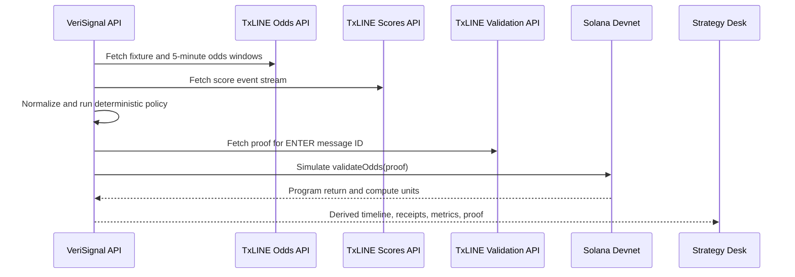
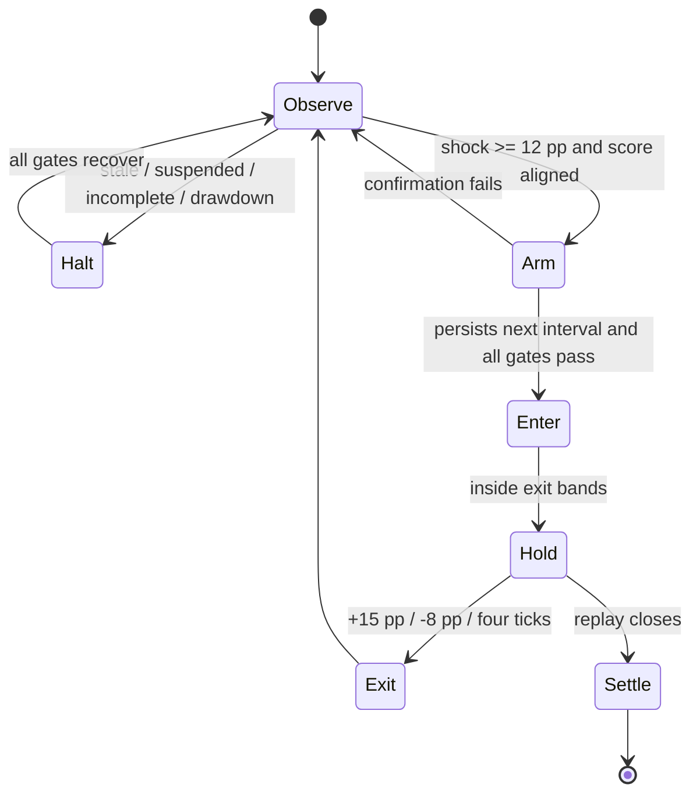

# VeriSignal Architecture

## Objective

VeriSignal demonstrates how a professional trading or market-operations team can run an autonomous strategy while preserving a verifiable explanation for every action. The public deployment uses paper execution so judges can test the complete workflow without an account, wallet, fee, or live capital.

## Runtime Pipeline

1. **Acquire**: the server fetches official TxLINE fixture metadata, five-minute odds-update windows, and the historical score event stream.
2. **Normalize**: only the full-game `1X2_PARTICIPANT_RESULT` market is retained. Prices are converted into normalized implied probabilities, and the latest score mark is attached to each tick.
3. **Decide**: a pure state machine applies feed, market, score, and drawdown gates before it can arm or enter.
4. **Size**: a confirmed signal is sized with quarter-Kelly and capped at 2% of equity.
5. **Execute**: the hackathon deployment records a paper position and marks it against later probabilities.
6. **Attest**: each action hashes its canonical body plus the previous action hash.
7. **Verify**: for the entry message, the server retrieves TxLINE's Merkle proof and simulates the official `validateOdds` instruction against the TxLINE Solana devnet program.
8. **Present**: the UI receives only derived probabilities, action receipts, aggregate metrics, and proof metadata.

## Autonomous State Machine

There is no operator approval step. The UI's pause and restart controls affect visualization only; the API has already completed the full autonomous run.

## Determinism and Audit Chain

The core strategy is a pure function of `OddsTick[]` and `RiskPolicy`. Each `DecisionRecord` contains:

- sequence and TxLINE timestamp;
- action, side, probability, shock, score, stake, and P&L;
- explicit reason and pass/fail policy checks;
- TxLINE message ID;
- previous decision hash; and
- current decision hash.

The hash is SHA-256 over a recursively key-sorted JSON representation of the action body. Replaying identical normalized inputs with the same policy produces the same action sequence and audit head.

## Trust Boundaries

| Boundary | Control |
| --- | --- |
| TxLINE API to server | Bearer token stays server-side; errors fall back to a clearly labeled generated sequence |
| Source record to strategy | Market type, fixture, quote completeness, freshness, and score state are validated before use |
| Strategy to execution | Position cap, quarter-Kelly, exit bands, max hold, and drawdown kill switch are deterministic |
| Receipt to reviewer | Canonical hash chain makes edits or omitted actions detectable |
| TxLINE proof to Solana | Official IDL encodes `validateOdds`; program ID and Merkle root PDA are checked on devnet |
| Server to browser | Raw TxLINE records and credentials are not returned; only derived values and proof metadata leave the server |

## Solana Proof Path

For the real showcase entry message:

1. VeriSignal requests `/api/odds/validation?messageId=...&ts=...`.
2. It rebuilds the typed `odds`, batch `summary`, subtree proof, and main-tree proof.
3. It derives the `daily_batch_roots` PDA for the record's epoch day.
4. It builds the official `validateOdds` instruction from the TxLINE IDL.
5. It simulates the versioned transaction on Solana devnet with signature verification disabled because validation is read-only.
6. A `1` program return is exposed as `proof.status = passed` together with the root PDA, proof depth, payload hash, and compute units.

This path does not fabricate a transaction signature or claim on-chain settlement. It proves that the exact TxLINE record used by the agent is accepted by the official verification program.

## Production Evolution

The hackathon deployment deliberately separates strategy from execution. A professional deployment would replace the paper adapter with an allow-listed venue adapter and add:

- durable event ingestion and checkpointed cursor state;
- a secrets manager and per-venue credential isolation;
- idempotent order keys derived from the decision hash;
- pre-trade exposure and regulatory controls;
- signed operator policy versions and approval for policy changes, not individual trades;
- redundant RPC and TxLINE routes;
- order, fill, cancellation, and venue-reconciliation receipts; and
- monitoring for latency, slippage, drift, proof failure, and kill-switch activation.

The deterministic state machine, typed normalized feed, risk policy, and decision receipts remain unchanged across that replacement.

## Data Handling

VeriSignal never bundles a TxLINE dataset in the public repository. The deployed API fetches source data at runtime and returns only the minimum derived timeline required to explain the strategy. The reference sequence in `server/reference.ts` is generated project data and is labeled `reference-simulation` throughout the API and UI.
