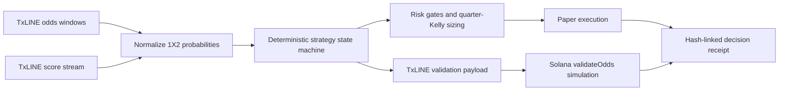

# VeriSignal

**An autonomous, proof-carrying strategy agent that turns TxLINE market and score updates into bounded, reproducible trading decisions.**

VeriSignal is built for the TxODDS World Cup Hackathon, **Trading Tools and Agents** track. It continuously ingests official TxLINE odds and score data, detects a confirmed consensus shock, sizes a paper position with quarter-Kelly, enforces hard risk gates, and emits a hash-linked receipt for every decision.

The deployed showcase replays a real TxLINE fixture window from France vs England (`fixtureId 18257865`). No button is required to create a trade: the same input deterministically produces `ARM -> ENTER -> HOLD -> EXIT`, while a later suspended quote produces `HALT`.

> Paper-execution research software. VeriSignal does not custody funds, place wagers, or deploy live capital.

## Judge Fast Path

1. Open the [live strategy desk](https://verisignal-agent.vercel.app). No wallet, account, token, or payment is required.
2. Watch the agent replay automatically. The execution tape exposes every action and policy check.
3. Select `ENTER` to inspect its TxLINE message ID, prior decision hash, decision hash, and official Solana proof result.
4. Run the public smoke test:

```bash
npm ci
BASE_URL=https://verisignal-agent.vercel.app npm run smoke:online
```

Expected evidence from the official replay:

| Evidence | Expected value |
| --- | --- |
| Run mode | `txline-replay` |
| Autonomous path | `ARM -> ENTER -> HOLD -> EXIT` |
| Defensive path | `HALT` on an incomplete/suspended market |
| Trades | `1` |
| Realized paper P&L | `+66.38` on a `$10,000` reference bankroll |
| Solana proof | `passed` |
| TxLINE proof message | `1838385918:00003:000174-10021-stab` |
| TxLINE devnet program | `6pW64gN1s2uqjHkn1unFeEjAwJkPGHoppGvS715wyP2J` |
| Proof depth | `19` |

The result is not hard-coded. Each API request fetches the official historical TxLINE windows and score stream, normalizes the 1X2 market, runs the strategy, retrieves the proof for the entry message, and simulates TxLINE's `validateOdds` instruction against Solana devnet. A clearly labeled generated reference sequence is used only when no TxLINE credential is configured or the upstream service is unavailable.

## Why It Matters

A production trading team needs more than a signal. It needs to know:

- which market event caused the action;
- which risk rules were enforced before execution;
- whether the source message can be cryptographically validated;
- whether the same inputs produce the same result; and
- why the agent refused to act when data quality degraded.

VeriSignal makes that evidence part of each action instead of an after-the-fact log.

## Strategy

**Confirmed Consensus Shock** looks for an in-play 1X2 implied-probability increase of at least 12 percentage points that agrees with the score state. It then requires the move to persist for one additional TxLINE interval.

When confirmed, stake size is:

```text
projected_p = min(0.98, market_p + max(0.02, shock * 0.18))
full_kelly = max(0, ((1 / market_p - 1) * projected_p - (1 - projected_p)) / (1 / market_p - 1))
stake_fraction = min(0.02, 0.25 * full_kelly)
```

The position exits at `+15 pp`, `-8 pp`, or after four ticks. The agent halts on stale data, incomplete quotes, market suspension, or a 3% drawdown. See [STRATEGY.md](./STRATEGY.md) for the complete deterministic state machine.

## Architecture



The browser receives derived probabilities, decisions, metrics, and proof metadata. Raw TxLINE records and API credentials remain server-side and are not redistributed. See [ARCHITECTURE.md](./ARCHITECTURE.md).

## API

| Endpoint | Purpose |
| --- | --- |
| `GET /api/agent?action=run` | Fetch TxLINE replay, execute the agent, and return proof-carrying receipts |
| `GET /api/health` | Verify service, autonomy flag, TxLINE configuration, network, and program ID |
| `GET /health` | Friendly rewrite for the health endpoint |

## Local Setup

Requirements: Node.js 20+ and a TxLINE API token.

```bash
npm ci
cp .env.example .env.local
# Add TXLINE_API_TOKEN to .env.local
npx vercel dev
```

Open `http://localhost:3000`. Without a TxLINE token, the app runs the labeled reference sequence so the interface and state machine remain testable.

## Verification

```bash
npm run lint
npm run test
npm run build
BASE_URL=http://localhost:3000 npm run smoke:online
```

The unit suite covers the profitable autonomous path, rejection of a score-conflicting signal, suspension halts, and deterministic audit hashes. The online smoke independently recomputes every decision hash and asserts both the execution and defensive paths.

## Judging Criteria Coverage

| Criterion | VeriSignal evidence |
| --- | --- |
| Core Functionality & Data Ingestion | Official TxLINE odds windows, historical score stream, and validation endpoint are fetched server-side on every run |
| Autonomous Operation | Deployment auto-runs the complete state machine without user input; `ARM`, `ENTER`, `EXIT`, and `HALT` are policy-driven |
| Logic & Code Architecture | Pure deterministic strategy function, explicit mathematical policy, unit tests, canonical hashes, documented trust boundaries |
| Innovation & Novelty | Each action carries its source identity, policy checks, hash-chain position, and Solana verification result |
| Production Readiness | No-wallet judge flow, hard risk gates, upstream fallback labeling, health endpoint, CI, online smoke, B2B audit surface |
| Demo | The strategy desk visualizes the real feed, autonomous decisions, risk refusal, and proof in one uninterrupted flow |

## Repository Map

```text
api/                 Vercel API handlers
server/              TxLINE client, normalization, strategy, verification
shared/              Public response types
src/                 Professional strategy desk UI
tests/               Deterministic strategy and UI tests
scripts/             Online smoke and demo tooling
server/idl/           Attributed official TxLINE devnet IDL
```

## Data and Attribution

VeriSignal does not commit or redistribute TxODDS market data. Runtime access is governed by the TxLINE developer terms. The devnet IDL is sourced from the official [`txodds/tx-on-chain`](https://github.com/txodds/tx-on-chain) repository for instruction encoding and is attributed in [THIRD_PARTY.md](./THIRD_PARTY.md).

## License

Application code is released under the MIT License. TxLINE data, APIs, trademarks, and the attributed IDL remain subject to their respective owners and terms.
